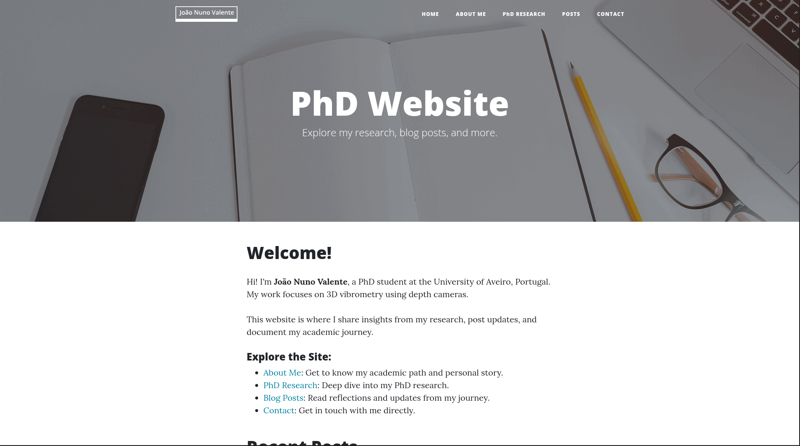

# My PhD Website

This is my personal academic website. It includes:

- A homepage with a short introduction
- An about page about me
- Blog-style posts for updates and reflections
- Research PhD page 
- Contact information

The website is built using [Jekyll](https://jekyllrb.com/), a simple static site generator, and uses a modified version of the [Clean Blog](https://github.com/StartBootstrap/startbootstrap-clean-blog-jekyll) theme by Start Bootstrap.

## Live Site

You can view the website at **[phd.joaonunovalente.com](https://phd.joaonunovalente.com)**.

## Preview

Here’s a quick preview of the website layout and pages:

## Suggestions & Feedback

Please feel free to [open an issue](https://github.com/joaonunovalente/phd-website/issues).
