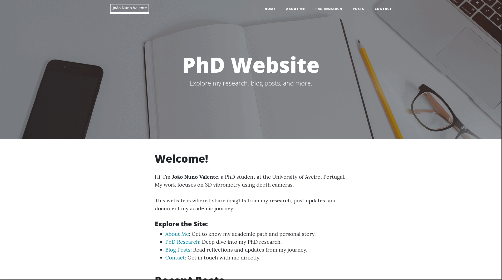

<h1 align="center">My PhD Website</h1>
<p align="center"><em>A personal academic site built during my PhD</em></p>

<p align="center">
  <a href="https://phd.joaonunovalente.com">
    
  </a>
  <a href="https://jekyllrb.com/">
    
  </a>
  <a href="https://github.com/StartBootstrap/startbootstrap-clean-blog-jekyll">
    
  </a>
</p>

---

## About

This is my personal academic website, created during my PhD. It includes:

- A homepage with a short introduction  
- An about page  
- Blog-style posts for updates and reflections  
- A dedicated research page  
- Contact page  

Built using [Jekyll](https://jekyllrb.com/) and based on a customized version of the [Clean Blog](https://github.com/StartBootstrap/startbootstrap-clean-blog-jekyll) theme.

The site also includes [Decap CMS](https://decapcms.org/) for editing posts through `/admin`. Post previews are rendered to match the public post page, and the CMS lets you pick a post `background` from the existing committed cover images while still supporting image uploads inside the body.

---

## Live Site

You can view the website at **[PhD.JoaoNunoValente.com](https://phd.joaonunovalente.com)**

---

## Preview

Here's a quick preview of the website layout and pages:



---

## Local Development

The project uses Jekyll with a small Node-based asset workflow. From a fresh clone, install the Ruby and Node dependencies first:

```bash
bundle install
npm install
```

Then use one of the following commands:

```bash
# Build the site into _site/
npm run build

# Serve the site locally with live reload
npm run serve

# Serve the generated site folder with BrowserSync
npm run start
```

If you prefer running Jekyll directly, these commands are equivalent:

```bash
bundle exec jekyll build
bundle exec jekyll serve --livereload
```

## Content Management

Open `/admin` in the browser to access Decap CMS.

- The `background` field lets you choose from the existing cover images already committed in the repository.
- Images inserted inside a post body are stored in the post-specific folder under `assets/img/posts/<date>-<slug>/`.
- Publishing still uses the GitHub backend, so Decap must be configured with GitHub OAuth access for the repository.

---

## Suggestions & Feedback

Feel free to [open an issue](https://github.com/joaonunovalente/phd-website/issues).
